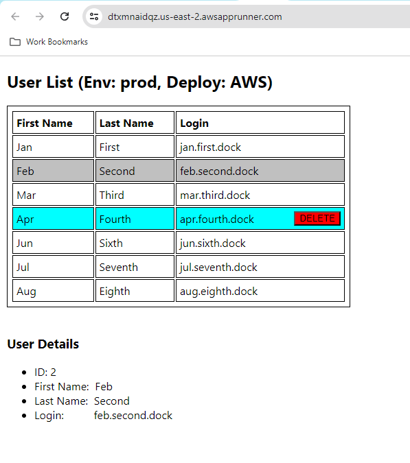

# react-app
Sample implementation of a React UI app, using remote REST API.

Screenshot of the react-app:

The app is currently deployed at AWS as:
https://dtxmnaidqz.us-east-2.awsapprunner.com/ 

Note: the react-app App Runner service may be stopped on occasion to save operational costs. 
Please contact me directly for the demo.

The project can be run
1. Locally from an IDE or command line:
   1. npm install
   2. npm run build
   3. npm start
2. As a Docker container:
   1. docker image build -t react-app:latest . 
   2. docker images  
   3. docker run -p 3002:3000 react-app
3. As AWS service: new image is built and deployed using GitHub actions on "push" to the "main" branch

Currently, the default connection of this app is to the [spring-boot-service](https://github.com/boroda123/spring-boot-service), 
which is deployed on AWS as: https://k7b3riigaa.us-east-2.awsapprunner.com/

